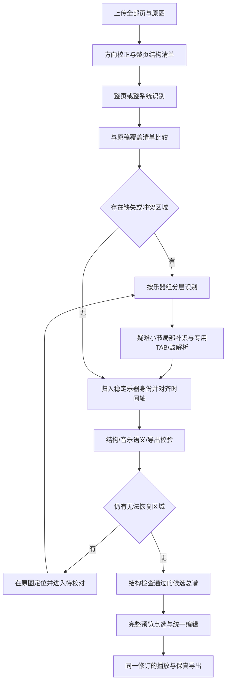

# 总谱识别完整性与复杂谱编辑实施方案

版本：2026-10-06 V1.1，补充复杂度、工期与GitHub项目核查。状态：方案完成，尚未按本方案实施或发布。本方案是现有[平台开发计划](music-notation-platform-development.md)的专项实施设计，不改写历史进度。

## 1. 产品目标与完成定义

核心交付是：用户上传完整PDF或照片后，得到按乐器归类的完整候选总谱；能够直接在完整谱上选音、校对、编辑，保存后预览、播放和导出保持一致。

完整性分开核查三个层次：

1. **原稿覆盖**：全部上传页、系统、乐器组、谱表及小节区域都有处理记录。一个区域失败也必须在原图中保留定位和待处理状态。
2. **结构完整**：应有的小节、声部、TAB及打击乐均恢复或有明确、合法的休止/隐藏谱表说明。缺失块不准消失，不以补造休符掩盖。
3. **音乐内容质量**：音高、时值、歌词、技法等单独评估。不把XML有效、引擎退出成功或小节时值相等当作全部音符正确。

只有结构完整性检查通过，才标记“结构检查通过”；未解决内容明确显示“待补识/待校对”。原稿模糊或结构检测不确定时，开放原图框选及乐器映射调整，再继续自动识别。候选正式接受仍由用户执行。已经检测或确认的区域不能静默消失；独立布局检测和识别引擎也可能同时漏检，因此自动结构检查不是全内容正确的证明。完整性目标通过独立标注原稿与零结构遗漏回归验收落实，任意模糊原稿的全部音符自动准确仍需要测试与人工复核。

## 2. 本次核实的工程起点

- 线上Audiveris为5.10.2。现有流程仍按0/90/180/270度的首个成功退出选择识别结果，缺少整页覆盖比较。
- 成功朝向输出选择、拒绝静默挑选多movement片段、多逻辑page的诊断读取已经修复，继续保留。
- Audiveris自身不提供按乐器裁片后同步合并的现成CLI；`-sheets`选择物理页，`-playlist`用于顺序组合书页。裁片、上下文携带、同乐器归类和共同时间轴合并需要本项目实现。[官方CLI](https://audiveris.github.io/audiveris/_pages/guides/advanced/cli/)、[Split and merge](https://audiveris.github.io/audiveris/_pages/guides/main/book_portions/split_merge/)。
- Audiveris5.10.2的TAB支持是检测后忽略其区域，不能承担弦品识别，需独立TAB识别适配器。[固定版本说明](https://raw.githubusercontent.com/Audiveris/audiveris/5.10.2/docs/_pages/guides/specific/tablature.md)。
- 当前ScoreJSON v2缺少完整TAB、演奏技法、歌词延长线及原XML未建模节点；普通导出会丢失这些信息。
- 本轮还在现有复杂谱派生导出上复现MusicXML XSD校验失败：writer将staff放在notations/lyrics之后。有效原XML与派生writer必须分别验收。[MusicXML note子元素顺序](https://www.w3.org/2021/06/musicxml40/musicxml-reference/elements/note/)。
- OSMD实际依赖2.0.0（内部VexFlow1.2.93），独立编辑器VexFlow5.0.0；两个渲染器不能共用内部图形对象。复杂谱主预览目前防错降级为不绑定音符，需替换为真实对象映射。先改用包内完整类型，移除当前遮蔽真实API的简化声明，并固定适配器版本契约。
- 此前真实OMR测试主要核查最小页/小节/音符数，需要增加与原稿独立对照的完整性真值。

## 3. 识别总流程

循环有每区域尝试上限及总任务资源上限；超过上限转为可继续处理的待校对，不无限重试。

## 4. 第一步：先建立原稿结构清单

新增SourceLayout，独立于最终OMR结果保存：上传页序、原稿印刷页码、图像尺寸、作品/乐章候选边界、系统区域、谱表线数、谱表组、大括号/括号、乐器名称与缩写、小节线及候选节奏区域。workId/movementId与系统/小节身份一起保存；真实多作品、多乐章形成合集或独立候选，边界有歧义时先确认，不能强行拼成一条演奏时间线。

先用独立的线组/连通区域检测建立布局，与Audiveris GRID结果交叉核对。检测 disagreement、被截断谱表及未解释的音乐区域标记待确认，不能只以同一引擎输出作为“预期内容”。标题等非音乐区域有排除原因；空白系统不能直接当无内容删除。

方向选择保留EXIF、旋转、缩放、去倾斜和裁切变换链；比较正确谱号、文字方向、乐器组与整页覆盖。水平谱线本身不能判定0度与180度。文本/OCR不明确时用多种证据，不能依赖某种语言OCR包必然存在。每个分支的输入、日志、结果与失败阶段都有持久化记录。

系统沿演奏顺序编号；印刷小节编号与内部小节ID分开。弱起、变拍号、跨页编号重复、多小节休止、隐藏空谱表均需专门表示，不能一律按4/4或固定谱表数量检查。

## 5. 第二步：整页、整系统与乐器组逐级识别

| 识别层级 | 输入与作用 | 升级条件 |
|---|---|---|
| 整页 | 干净简单谱快速生成候选，同时保留完整上下文 | 多系统遗漏、错误分组、冲突或覆盖不足 |
| 整系统 | 一整行同时演奏的所有乐器，保留小节线和乐器相对位置 | 个别乐器仍漏识或错识 |
| 乐器组 | 对失败乐器独立处理；钢琴双谱表、风琴多谱表作为同一组 | 某个小节或符号仍不确定 |
| 小节与局部符号 | 带前后上下文的缺失区域；比较变体和专用解析结果 | 证据不足则进入人工校对 |

复杂且乐器很多的总谱可以从整系统直接调度乐器组，不必对明显失败的整页反复耗时。识别层级是算法处理分层；开发批次见第13节，两者不混用。

裁切保留必要边距、乐器标签、谱号、调号、拍号、歌词和跨谱表记号。跨谱表beam/slur、钢琴双谱表不能硬拆。局部小节缺少起始谱号时，从已确认上下文建立识别入口并记录注入字段，不把补入的上下文冒充原图识出的符号。

局部裁片保留重叠的前后小节；合并仅替换目标范围。跨边界tie/slur/歌词延长线使用稳定span端点处理，避免边界丢失、重复音或整段覆盖已人工修正内容。每个符号坐标通过可逆变换回到原图。

## 6. 第三步：相同乐器归类与共同时间轴合并

在每个已确认作品/乐章范围内建立logicalPartId，识别名称、缩写、谱号、谱表组结构、调号/移调属性及跨系统相对位置，共同判断物理谱表属于哪个演奏轨道。跨乐章乐器身份可关联，演奏时间线不自动续接。规则与身份置信状态可在原图中修改。[Audiveris Logical Parts](https://audiveris.github.io/audiveris/_pages/guides/specific/logical_parts/)也明确复杂映射可能需要辅助。

- 钢琴右手和左手：一个逻辑乐器，保留两谱表、多声部。
- 吉他五线谱和TAB：一个演奏轨道，两种记谱视图，关联同一演奏事件。
- 小提琴I、小提琴II：同乐器类型的两个独立声部，保持独立身份。
- 隐藏空谱表、后段加入的乐器、同一演奏者换乐器：保存各系统实际关系及乐器生效范围。
- 缩写缺失、合并谱/divisi身份不确定：保留映射候选供用户确认，不能仅按名称或“第几行”自动拼接。

同一作品/乐章内，同一系统各乐器按共同小节边界与有理数拍点对齐；跨系统沿阅读顺序续接。`sequence`负责顺序，ID持久不随插入或重排改变。识别裁片中的临时编号不能直接当全谱小节编号；重复名、重复印刷编号和反复回放另处理。异拍/自由拍的例外明确记录，不能强行将全部声部补成相同四拍。

引擎意外把同一乐章切成多个movement时，只有原稿边界与音乐上下文能证明连续才重接；真正的多乐章保持边界。现有MULTIPLE_MOVEMENTS保护在边界模型和相应回归通过前继续保留。

标准谱与TAB的相同事件只播放一次；两个不同乐器同音同时演奏仍是两个事件。重叠裁片去重依据原稿来源和事件关系，不能按音高/时刻全局去重。

## 7. 第四步：TAB、鼓谱与省略记法专用识别

**TAB适配器**：检测4/6线等真实线组，识别弦上的品数、多位数字、静音x、H/P、bend/slide，读取调弦与capo。与相邻标准谱的节奏/和弦对齐；音高比较计入乐器八度记谱与移调。没有调弦资料时，使用明确的候选配置供确认；不把标准调弦猜测写成已确认原稿。

**鼓谱适配器**：支持1线与5线等谱表，结合谱号、位置、音头形状、乐器图例映射打击乐ID。显示位置与实际音色分离；同一显示位置的x/普通音头可能代表不同打击乐。无图例或证据冲突时允许编辑鼓件映射。

**省略与反复**：区分同音/同和弦重复省略、小节反复、多小节休止、未指定音高的节奏谱、静音击弦和真正识别漏音。重复展开有前驱范围、原图符号、时值和推断来源；新攻击分配新事件ID，延音保持tie关系。跨休符、跨乐器或前驱不明时进入校对。可让用户选择展开显示或保留省略记法，播放使用实际事件。[MusicXML measure-repeat](https://www.w3.org/2021/06/musicxml40/musicxml-reference/elements/measure-repeat/)要求写出实际重复音乐，同时记录省略显示。

专用识别先以可解释规则和局部数字/符号识别实现；框选手工纠正也经过同一事件模型。分层和裁切不能解决的符号类别，由可替换识别适配器处理，不能假定更小裁片必然成功。

## 8. 完整性检查与自动补识

建立“作品/乐章 → 页 → 系统 → 乐器组 → 逻辑小节 → 声部/记谱视图”的覆盖矩阵，每格记录应有区域、实际事件、合法休止/隐藏说明、未解决问题及证据。音符未读清时保存未解决的音乐区域，不伪造成休符。

检查包括：

1. 页及系统覆盖：输入全部页均有结果或明确待处理状态。
2. 乐器覆盖：每个预期逻辑乐器和其实际出现区间都有映射。
3. 小节覆盖：与原图小节线/编号/跨页关系对应，无漏段、重复段和错误拼接。
4. 声部时值：按有效拍号、弱起、tuplets、grace、backup/forward核查；和弦不能重复累加时值。
5. 内容一致：标准谱与TAB、移调前后、重复来源、tie/slur/技法端点及歌词连续性对应。
6. 文件与界面一致：schema有效、事件与保留节点无丢失、预览/编辑/导出同revision。

失败按区域生成补识任务：方向复选 → 保留上下文的重裁 → 调整局部预处理 → 专用识别 → 人工校对。只替换已验收的新区域，复用其他成功区域；不得覆盖客户后续编辑。

结构全覆盖并不等于音高全对。产品进度显示实际可理解的信息，例如“已完成10个乐器；吉他第17小节待校对”，不展示虚构音符准确率。输出不完整时明确状态，允许用户继续修谱或保存标有缺口的草稿；完整导出需要通过结构和未解决区域检查。面向用户用“结构检查通过，待校对音符”等分项状态，不能用一个“识别完整”标记暗示所有音符准确。

## 9. 编辑与导出共同的数据基础

扩展到ScoreJSON下一schema版本，保留当前v2读取及显式迁移。增量字段至少包含：

| 模型 | 内容 |
|---|---|
| Work/Movement/SourceLayout | 作品/乐章边界、页、系统、物理谱表、乐器组、小节区域及原图变换 |
| LogicalPart/InstrumentAssignment | 持久乐器身份、演奏者/声部区分、区间内换乐器 |
| MusicalEvent | 稳定ID、音高/无固定音高、节奏、声部、移调及来源 |
| NotationView/NotationNote | 标准谱/TAB/鼓等记谱视图、独立ID、对演奏事件的引用 |
| Technical/Lyric/Span | string/fret/tuning/capo、H/P/bend/slide、text可空的歌词extend、跨音符范围 |
| Attributes/Directions | 谱号、调号、拍号、移调、速度/力度及其生效拍点；保留重复与跳转关系 |
| PreservedNotation | 原XML有序树、未建模节点、节点索引及依赖范围，随修订保存 |
| Coverage/Attempts | 覆盖状态、尝试版本、日志、缺口及校订来源 |

ScoreJSON仍是编辑真相：有序XML树和未建模记号是同一revision里的保留层，必须与核心事件在同一编辑命令/事务中更新。不可同时维护两个互相漂移的最新版。

导入保存完整结构；编辑只更新受影响节点，保留其余内容和合法元素顺序。新建节点按标准writer生成。未建模但与移动/删除/移调相关的节点，先显示受影响对象和可选处理，禁止悄悄丢弃；已实现的TAB/技法/歌词字段提供正常编辑器，不以“只保留XML”冒充功能完成。

改标准谱音高后，TAB候选按真实调弦、capo、弦品范围及邻音可演奏性计算；多种指法让用户选择。改TAB品数时同步演奏音高。删除音符、移动小节或修改节奏，关联视图及跨音符记号同一事务更新，失败则不提交半个结果。[MusicXML TAB表示](https://www.w3.org/2021/06/musicxml40/tutorial/tablature/)。

第一批先落实后台关联更新与依赖检查：已有确定映射的编辑原子更新；尚不能同步的TAB或跨音符依赖明确阻止受影响编辑并给出待处理对象，禁止保存变更音高但保留旧TAB的矛盾版本。第三批完善指法选择等联动界面，并解除已实现能力范围内的临时限制。

MusicXML/PDF/SVG/PNG/播放均从同一完整修订派生；简谱等格式固有无法表示的符号提供明确能力说明。导出前做XSD及语义差异校验；核心支持范围要求零非预期丢失。支持“完整总谱”及“选择乐器分谱”导出；保留用户上传原件及所有历史修订。

## 10. 完整预览与图形编辑必做功能

原图、完整MusicXML预览、VexFlow编辑器共享选择状态。点击完整总谱中的主谱/TAB/鼓谱音符、和弦各音、休符后，三处定位同一事件/记谱对象并打开对应属性。编辑、保存、撤销、重做、刷新后仍一致。

将stable notationNoteId写入MusicXML note id，通过固定OSMD2.0.0版本的小型解析桥记录XML节点与SourceNote对应；再经真实GraphicalNote获取具体音头图形。缩放、分页、手机重排后重建命中注册表并按ID恢复选择。[VoiceGenerator.read](https://github.com/opensheetmusicdisplay/opensheetmusicdisplay/blob/0463b84f934f80f39fe400f3a56dada1ab3c393b/src/MusicalScore/ScoreIO/VoiceGenerator.ts#L118)、[EngravingRules.GNote](https://github.com/opensheetmusicdisplay/opensheetmusicdisplay/blob/0463b84f934f80f39fe400f3a56dada1ab3c393b/src/MusicalScore/Graphical/EngravingRules.ts#L1143)、[VexFlowGraphicalNote](https://github.com/opensheetmusicdisplay/opensheetmusicdisplay/blob/0463b84f934f80f39fe400f3a56dada1ab3c393b/src/MusicalScore/Graphical/VexFlow/VexFlowGraphicalNote.ts#L74)。和弦定位使用真实vfnoteIndex与音头模型；整和弦音头SVG数组不是事件身份，必要时为drawNoteHeads增加逐音元素引用桥。

坐标处理针对每个页面SVG使用实际CTM，不直接复用第一个页面的坐标换算；结合真实音头包围盒、可访问按钮和空间索引，不用DOM数组次序。图形与事件允许多对多：共享音头、多小节休止及跨页连线可对应对象集合或范围，同一演奏事件可有主谱/TAB等多个图形。命中注册表保存候选集合，重合声部提供选择器，不默认选第一个；cue/grace、共享音头、和弦音、跨谱表音符有独立测试。默认隐藏的对象没有虚假图形目标，但可在结构列表查看并选择。

编辑支持新增/删除音符与休符、和弦逐音、音高/临时记号、时值/附点/连音组、声部、谱表、音头、谱号/调号/拍号、速度/力度、TAB弦品、鼓件、歌词及延长线、连线与技法；小节插入/删除和移动必须同时检查时间轴、记谱视图及跨小节端点。支持乐器显示/隐藏、分谱、多个乐器同时查看、按页/系统跳转和缺口导航。OSMD未能显示的核心记号由绑定稳定对象的叠加层补齐，并有对应属性编辑，不以禁用整个预览的交互作为最终完成。

Enter修复：父级快捷键尊重defaultPrevented、IME及交互元素焦点；音符button上Enter/Space执行选择；输入/属性编辑区执行明确的保存约定；其他操作按钮保留自身动作。保存快捷键仅在指定编辑作用域生效；提交中、按键repeat及草稿无变化时不新增请求或修订。测试真实键盘按键与pointer点击，并核查实际保存POST次数，不用DOM click代替真实键盘通过。

大谱按页/系统虚拟化与局部更新，原图仅加载当前区域。OSMD2.0.0的renderNext/renderRemaining用于连续垂直或单行水平模式，不能当成A4分页增量渲染能力；连续视图分批绘制全部内容，真实分页采用完整布局及页级命中索引，资源过大时使用同版本后台分页产物与按需加载。打印/图像导出必须确认全部内容完成绘制。[固定版本分批绘制实现](https://github.com/opensheetmusicdisplay/opensheetmusicdisplay/blob/0463b84f934f80f39fe400f3a56dada1ab3c393b/src/OpenSheetMusicDisplay/OpenSheetMusicDisplay.ts#L377)。持久ID与排版布局分离；异步保存/识别回写有revision检查，旧结果不能覆盖新编辑。移动端有缩放/平移与明确选音模式，避免平移被当作改音。

## 11. 鼓声与统一播放

保留unpitched记谱位置，建立显式drumInstrumentId与MIDI键映射；General MIDI鼓轨使用通道10，MusicXML midi-unpitched的1基值与内部0基MIDI note区分。[MusicXML打击乐](https://www.w3.org/2021/06/musicxml40/tutorial/percussion/)。

浏览器将有音高轨送至旋律音源，鼓轨送至Tone.Player/Players或等价样本播放器。按实际鼓件选择本地许可清楚的样本，避免按钢琴音高播放鼓或用自动移调代替另一鼓件。保留独奏/静音/音量、velocity、拍点、tempo map、循环和停止释放。相同TAB事件不再多播一次。

播放时间线来自同一修订；静音吉他、鼓件与未知映射分别处理，不能把所有unpitched一律当鼓。连续播放、暂停恢复、手机音频解锁、切标签与循环边界测试真实AudioContext；MIDI/音频导出对照同一事件清单。

## 12. 队列、断点与现有服务器

维持当前共享服务器重引擎单并发；按页、系统及乐器区域排队，异步展示阶段进度。布局轻任务与重识别分别限额，避免大量裁片同时启动Java进程。

每区域持久化jobId、regionId、engineVersion、预处理参数、输入哈希、尝试日志及输出哈希；相同版本输入可复用结果，失败区域可独立续跑，取消有明确边界。一个用户导入是一个外层操作，内部裁片与自动补识不重复扣用户额度；恢复与重提交规则复用现有额度逻辑并增加幂等检查。

临时目录清理前将必要证据按保留期写入项目对象存储；原件、布局、选中识别结果和失败摘要持续可查，体积大的中间变体按容量回收。增加失败阶段与PDF解析异常摘要，不记录会话token或私密凭据。

固定识别引擎版本。官网较新版本的能力不能直接视为5.10.2已有；内部多页并行参数或升级要通过隔离回归与负载测量后采用。先测代表性2/6/20以上乐器、多页谱的峰值内存、时间、临时盘与其他网站可用性，再设置页/子任务预算。页多或乐器多时串行继续处理并可恢复，不静默截断到前几页。

## 13. 分批交付顺序

| 批次 | 必交付内容 | 进入下一批的验收 |
|---|---|---|
| 第一批：数据与完整性基础 | 修XML writer顺序与XSD门禁；扩完整记谱模型和保留层；稳定ID；关联编辑后台检查；作品/乐章边界与SourceLayout/覆盖报告；Enter修复；识别阶段日志 | 原稿/未编辑导出/受支持单音编辑后完整符号保留；不支持的依赖编辑明确阻止；已标注半页缺失夹具被检测；真实Enter不误保存或重复提交 |
| 第二批：分层识别闭环 | 整页→系统→乐器组→局部区域调度；方向质量比较；跨页乐器映射与共同时间轴；区域补识/断点 | 两系统六乐器八小节测试不再丢下半页；同名不同声部不错误合并；人工编辑不被补识覆盖 |
| 第三批：专用解析与复杂预览编辑 | TAB/鼓/省略适配器；OSMD对象桥与每页命中；标准谱-TAB联动；核心技法/歌词编辑 | 完整总谱每类对象真实可选可改；主谱/TAB同音一次播放；真实鼠标/键盘/触控均通过 |
| 第四批：播放、规模与正式发布 | 鼓样本音源；大谱虚拟化；复杂格式往返；多页压力与故障恢复；灰度生产 | 音频、预览、导出同修订；目标设备与当前服务器预算通过；回滚不丢新数据 |

预览对象映射和编辑器工作在第一批稳定ID完成后并行开发；第三批是整体验收节点，不能将其降为可选后续功能。每批都有可复查产物与独立回归，未通过完整性门禁的自动结果继续明确标记待校对。

## 14. 验收与测试集

首批使用授权的私有回归总谱与原创/合法公开谱，独立人工标注结构和音乐语义。至少覆盖：单谱表、钢琴双谱表、多系统六乐器混排、TAB、鼓、同名多声部、乐器进出/隐藏空谱表、跨staff beam/slur、弱起/变拍/异拍、多小节休止、省略与节奏谱、反复、多页/旋转/阴影/裁边、大型多乐器、真多作品/多乐章及引擎错误分段。合成变体有标记，不能冒充真实扫描质量样本。

结构真值包括全部页、系统、逻辑乐器及出现区间、物理谱表/记谱视图、每乐器的小节和声部。独立标签先于识别结果；测试不是只要求minNotes或minMeasures。

当前私有复杂谱作为首个回归基线：2个系统、6个逻辑乐器、8个物理谱表（含2个TAB视图），各乐器8小节，共30个四分音符拍点。按人工原稿标注逐项核查；该结构只用于这份夹具，不能硬编码为其他乐谱的预期数量。

硬性验收：

- 已知完整回归谱：漏页、漏系统、漏乐器、漏小节、重复合并均为0。
- 已标注的遮挡/损坏/失败区域回归集：必须被标记并阻止完整导出状态；不能补假休符通过。此结果不外推为对所有未知缺陷的检测保证。
- 关键支持字段无非预期丢失；未编辑导出与单音编辑后均核对TAB、技法、歌词延长线和跨音符关联；XSD通过。
- 稳定ID在选择、编辑、插入/重排、缩放、分页、刷新、撤销/重做后正确；金标谱全部可见核心记谱对象的映射覆盖率100%、未映射数和错误映射数均为0，并逐类做真实交互。隐藏对象单独核对，不以bound=0或DOM click当交互验收。
- 同一演奏事件的TAB不重复发声；鼓事件可听、可独奏、与MIDI事件时间/音色映射一致。
- 网络中断、服务重启、子任务失败、重试/取消后能恢复，并且不重复扣额度，不覆盖客户新版本。

性能门禁固定测试设备、浏览器与谱规模，分别测首屏可操作时间、重排耗时、点击响应、峰值内存与服务器临时盘；第一批实测后冻结预算，第四批按同样条件判定。交互映射覆盖率不是音符识别准确率，两者分别报告。

完整性、音高/时值/声部/TAB准确性、自动完整成功率、待校对率、耗时及资源占用分别发布实测结果。分项准确率阈值由第一批合法金标实测确定并固定；结构检查分数、引擎grade、人工补全结果不能混成自动准确率。每批先本地，再生产等价预发布，最后逐批上线；客户既有修订与原件保持可恢复。

## 15. 具体代码落点

| 工作 | 当前文件与拟新增模块 |
|---|---|
| 模型/迁移/稳定ID | packages/shared/src/index.ts；新增记谱视图/保留层/覆盖类型 |
| 原稿布局/坐标/规划 | worker新增omr-layout、omr-plan、source-transform模块 |
| 引擎尝试与日志 | services/worker/src/audiveris-runner.ts、audiveris-output.ts、audiveris-omr-diagnostics.ts |
| 分层调度/归类/合并 | services/worker/src/index.ts；新增omr-region、omr-part-map、omr-merge、omr-coverage模块 |
| TAB/鼓/省略 | 新增notation专用识别适配器与乐器上下文规则 |
| 完整解析/编辑/导出 | API与worker两个musicxml-score-parser.ts、score-edit.ts、score-musicxml-export.ts及导出路由 |
| 主预览和编辑 | ScoreMusicXmlPreview.tsx、ScoreCandidateReviewWorkspace.tsx、ScoreVisualEditorPanel.tsx、VexFlowNotationSurface.tsx；新增渲染身份桥/命中注册表 |
| 鼓与统一时间线 | ScorePlaybackPanel.tsx、PracticeRecorder.tsx、score-playback.ts、score-midi-export.ts及worker渲染 |

两套parser必须共享语义实现或强制同夹具一致性测试，避免API与worker不同理解。新数据增量迁移；独立构建可追踪发布，不将当前工作区其他未发布改动混入本次上线。

本轮交付方案及来源核查。开发完成状态以各批真实验收和部署记录为准。

## 16. 复杂度、研发工期与运行等待

现有文件、队列、乐谱版本、候选确认、基础编辑、Audiveris、OSMD/VexFlow和播放模块可以继续使用。主要复杂度来自原稿与事件身份对应、跨页乐器映射、裁片同步合并，以及编辑后保持XML与关联记号一致。分层识别只在有缺口的区域继续下钻，成功区域直接复用；不能默认每张谱对全部乐器和全部方向都运行所有层级。

按一名熟悉项目的工程师、AI辅助、持续投入估算。下表是有效工作日，包含相应范围的回归与发布检查，均未实际完成；累计值已经包括此前行，不可再次相加。

| 交付范围 | 累计工作量 | 边界 |
|---|---|---|
| 紧急错误修复 | 3–5日 | XML writer顺序及XSD门禁、Enter与重复提交、导出损失检测；保留原件和正确原XML；受影响但尚不支持的编辑明确阻止 |
| 限定谱型的核心可用版 | 13–23日，约3–5个工作周 | 已标注标准谱的识别、缺口定位、校对与受支持音符编辑；保真输出；复杂TAB/技法保持完整预览但尚不能宣称全部可编辑 |
| 本方案全部专项能力 | 63–118日，约13–24个工作周 | 在规定测试集内完成多乐器分层识别、专用解析、完整复杂谱交互和关联编辑、鼓播放、多页性能及恢复验收；仍不承诺任意模糊图片全自动正确 |

建议首个2–3工作日技术试验包含本次六乐器总谱、钢琴双谱表和一份多页谱，分别验证局部分层能否补漏、单音编辑后的TAB/技法/歌词是否保真，以及完整预览对象映射是否准确。这是上述工作量内的估算校准步骤；试验结果决定复用路线与后续范围，不先承诺精确完工日期。

完整版新增工作量主要分为：分层识别与合并20–40日；完整复杂编辑、播放和规模验收30–55日。该保守预算与限定可用版范围不同，不把“接通一个GitHub演示”计作产品完成。多角色并行能缩短部分日历时间，数据身份和编辑保真仍是依赖关键路径。已完成的历史修复不重复计入。

如果现有引擎与规则不能满足目标类别，模型训练另算：先用5–10日核查失败类别、数据及试验收益，再估计标注与训练工作量；不能提前把它包含在短期修复预算中。优先不训练新模型，以现有引擎、布局、区域补识和校对闭环验证收益。

用户每份乐谱的等待时间与研发工期分开。现有一份复杂单页历史任务创建后约2分34秒完成，含上传约2分52秒，但结果有漏识，仅是旧流程墙钟参考。新分层方案未做运行基准；正常路径可只做一轮识别，失败路径需要额外局部任务。实施时对简单页、混排总谱和多页大谱分别测排队与处理耗时、峰值内存，并对外公布实测范围。当前共享服务器维持重引擎串行与断点恢复。

## 17. GitHub学习与复用取舍

2026-10-06核查公开官方仓库、文档与源码入口；本轮未接入或部署新引擎。项目许可证与模型权重分别核对，实施时固定提交/版本并用本项目夹具测能力，不能把README功能清单当完整性验收。

| 项目 | 本次值得借鉴的部分 | 采用方式与限制 |
|---|---|---|
| [Audiveris](https://github.com/Audiveris/audiveris) | 系统、物理/逻辑乐器映射、MusicXML与OMR诊断；[5.11.0](https://github.com/Audiveris/audiveris/releases/tag/5.11.0)含多页并行、扫描导出、打击乐谱号修复 | 保持主引擎，隔离比较5.10.2与新版；AGPL-3.0。版本升级不是总谱完整保证，仍需本站覆盖与合并层 |
| [homr](https://github.com/liebharc/homr) | 先布局分割、谱表锚点与括号分组，再语义识别；[staff_detection.py](https://github.com/liebharc/homr/blob/main/homr/staff_detection.py)、[ONNX分块推理](https://github.com/liebharc/homr/blob/main/homr/segmentation/inference_segnet.py)及[分项基准](https://github.com/liebharc/homr/blob/main/Benchmark.md) | 先作为布局/拍照补识评测。主要为高低音谱号音高与节奏，不证明完整TAB/鼓/技法能力；imgpos为粗略位置。公开[ONNX权重](https://github.com/liebharc/homr/releases/tag/onnx_checkpoints)，维护者说明[代码和权重均AGPL](https://github.com/liebharc/homr/discussions/155)；有CPU路径但4GB共享机适用性未测 |
| [Smoosic](https://github.com/Smoosic/Smoosic) | 浏览器总谱编辑、分谱、播放、MusicXML导入导出；[tracker](https://github.com/Smoosic/Smoosic/blob/main/src/render/sui/tracker.ts)、[选择模型](https://github.com/Smoosic/Smoosic/blob/main/src/smo/xform/selections.ts)、[编辑命令](https://github.com/Smoosic/Smoosic/blob/main/src/render/sui/scoreViewOperations.ts)、[TAB属性界面](https://github.com/Smoosic/Smoosic/blob/main/src/ui/dialogs/tabNote.ts) | 重点学习选择与重绘、撤销和编辑命令架构。MIT，使用自己的VexFlow分支及SMO模型；当前[XML writer](https://github.com/Smoosic/Smoosic/blob/main/src/smo/mxml/smoToXml.ts)未覆盖全部unpitched、TAB弦品/技法和歌词extend字段，不能替换本站模型并假定复杂谱保真 |
| [alphaTab](https://github.com/CoderLine/alphaTab) | 标准谱/TAB联合显示、吉他技法、打击乐、MusicXML导入和浏览器合成播放；[音符点击](https://docs.alphatab.net/docs/reference/api/notemousedown)、[鼓映射](https://github.com/CoderLine/alphaTab/blob/develop/packages/alphatab/src/model/PercussionMapper.ts) | MPL-2.0。学习TAB视图、技法与声音映射，必要时隔离验证专用视图。它不做照片识谱；[官方导出](https://docs.alphatab.net/docs/guides/exporter)列Guitar Pro/AlphaTex，不能替代本站MusicXML完整保留层，运行时Note.id也需桥接持久身份 |
| [OSMD](https://github.com/opensheetmusicdisplay/opensheetmusicdisplay) | 已用的MusicXML预览、图形对象、TAB显示与分页 | 保持当前预览底座，按第10节补身份桥。BSD-3-Clause；官方明确为渲染器而非完整交互编辑器，全部可编辑仍由本站实现 |
| [MuseScore Studio](https://github.com/musescore/MuseScore) | 多声部、TAB、打击乐和MusicXML导入导出实现；外部打开与演奏语义交叉核对 | 用作桌面验收与实现参考；GPL-3.0、C++/Qt路线，不作为首版网页编辑器替换，也不能将其再次导出当无损证明 |

补充仅作研究：[oemer](https://github.com/BreezeWhite/oemer)的去弯曲/符号边界框可参考，README已推荐homr为改进版，避免再同时接整个引擎；[Verovio](https://github.com/rism-digital/verovio)以MEI/SVG为核心，可研究图形身份及交互，首版不再引入另一完整谱模型。

近期优先研究组合为Audiveris＋Smoosic编辑架构＋homr布局思路，alphaTab用于TAB/声音专项。识别底座和排版可以复用，本站原稿覆盖、乐器归类合并、编辑保真和验收依然需要完成。
